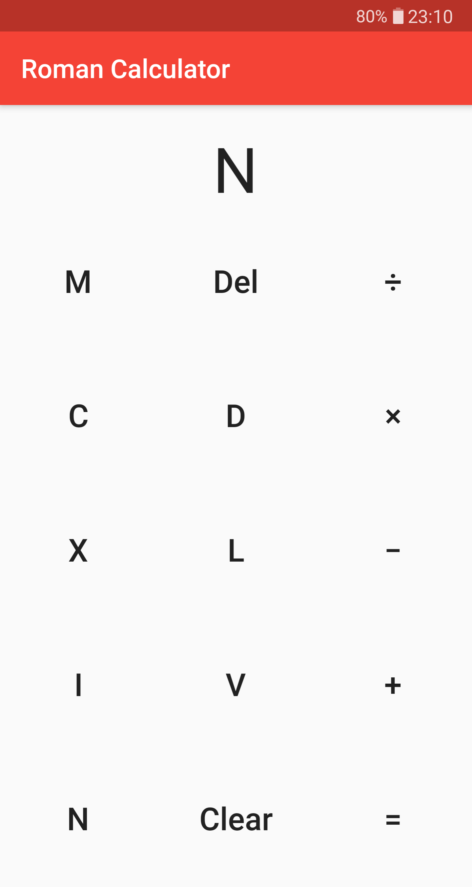

# Roman Calculator

A calculator using
[Roman numerals](https://en.wikipedia.org/wiki/Roman_numerals).



## Building

### Dependencies

- [Flutter SDK](https://flutter.dev/docs/get-started/install)
- Android SDK (building for Android)

### Build instructions

Connect device and run 

```
flutter run
```

For release build run 

```
flutter run --release
```